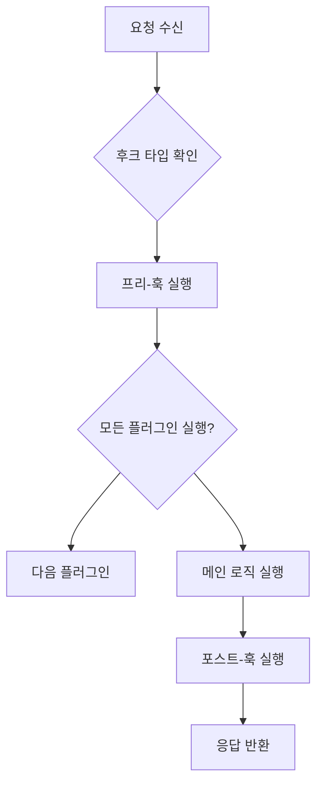
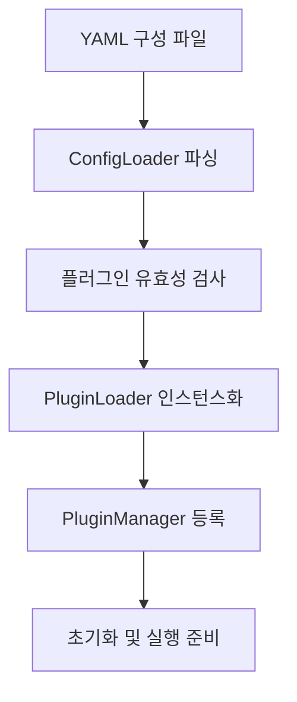

# MCP Gateway Plugin Framework - 확장성 아키텍처 가이드

## 개요

`plugins/` 폴더는 MCP Gateway의 확장성 아키텍처를 담당하는 플러그인 프레임워크를 구현합니다. 이 프레임워크는 게이트웨이의 핵심 기능을 수정하지 않고도 새로운 기능을 추가하거나 기존 동작을 변경할 수 있게 해줍니다.

## 플러그인 프레임워크 구조 개요

```
plugins/
├── __init__.py                          # 플러그인 계층 초기화
├── framework/                           # 코어 플러그인 프레임워크
│   ├── __init__.py                      # 프레임워크 초기화
│   ├── base.py                          # 플러그인 기본 클래스 및 인터페이스
│   ├── constants.py                     # 프레임워크 상수 정의
│   ├── errors.py                        # 플러그인 관련 에러 클래스
│   ├── manager.py                       # 플러그인 매니저 (실행 조율)
│   ├── models.py                        # 플러그인 데이터 모델
│   ├── registry.py                      # 플러그인 인스턴스 레지스트리
│   ├── utils.py                         # 플러그인 유틸리티 함수
│   ├── loader/                          # 플러그인 로딩 시스템
│   │   ├── __init__.py
│   │   ├── config.py                    # 구성 파일 로더
│   │   └── plugin.py                    # 플러그인 로더
│   └── external/                        # 외부 플러그인 지원
│       ├── __init__.py
│       └── mcp/                         # MCP 기반 외부 플러그인
│           ├── __init__.py
│           ├── client.py                # 외부 MCP 클라이언트
│           └── server/                  # 외부 MCP 서버 런타임
│               ├── __init__.py
│               ├── runtime.py           # MCP 서버 런타임
│               └── server.py            # MCP 서버 구현
└── tools/                               # 플러그인 개발 도구
    ├── __init__.py
    ├── cli.py                           # 플러그인 CLI 도구
    └── models.py                        # 도구 관련 모델
```

## 코어 프레임워크 컴포넌트

### 1. 플러그인 기본 클래스 (`framework/base.py`)

**역할**: 모든 플러그인의 기본 클래스 및 인터페이스 정의
**주요 기능**:
- 플러그인의 생명주기 관리 (초기화/실행/종료)
- 후크 포인트 인터페이스 정의
- 메타데이터 및 구성 관리

**주요 클래스**:
```python
class Plugin(ABC):
    """모든 플러그인의 기본 추상 클래스"""

    @property
    def name(self) -> str:
        """플러그인 고유 이름"""
        return self._config.name

    @property
    def mode(self) -> PluginMode:
        """플러그인 실행 모드 (ENFORCE/PERMISSIVE/DISABLED)"""
        return self._config.mode

    @property
    def priority(self) -> int:
        """실행 우선순위 (낮을수록 높은 우선순위)"""
        return self._config.priority

    async def initialize(self) -> None:
        """플러그인 초기화"""
        pass

    async def shutdown(self) -> None:
        """플러그인 종료 정리"""
        pass
```

### 2. 플러그인 매니저 (`framework/manager.py`)

**역할**: 플러그인의 실행을 조율하고 관리하는 중앙 관리자
**주요 기능**:
- 플러그인 생명주기 관리
- 타임아웃 보호 및 에러 격리
- 우선순위 기반 실행
- 조건부 실행 지원

**핵심 기능**:
- **실행 조율**: 여러 플러그인을 우선순위에 따라 실행
- **타임아웃 보호**: 각 플러그인의 실행 시간 제한
- **에러 격리**: 한 플러그인의 실패가 다른 플러그인에 영향 미치지 않음
- **컨텍스트 관리**: 플러그인 간 상태 공유 및 정리

**주요 클래스**:
```python
class PluginManager:
    """플러그인 매니저 - 싱글톤 패턴"""

    async def prompt_pre_fetch(
        self,
        payload: PromptPrehookPayload,
        global_context: GlobalContext
    ) -> tuple[PromptPrehookResult, PluginContextTable | None]:
        """프롬프트 가져오기 전 플러그인 실행"""
        return await self._execute_hooks(
            HookType.PROMPT_PRE_FETCH,
            payload,
            global_context
        )

    async def tool_pre_invoke(
        self,
        payload: ToolPreInvokePayload,
        global_context: GlobalContext
    ) -> tuple[ToolPreInvokeResult, PluginContextTable | None]:
        """도구 호출 전 플러그인 실행"""
        return await self._execute_hooks(
            HookType.TOOL_PRE_INVOKE,
            payload,
            global_context
        )
```

### 3. 플러그인 레지스트리 (`framework/registry.py`)

**역할**: 로드된 플러그인 인스턴스들의 등록 및 검색
**주요 기능**:
- 플러그인 등록/해제
- 후크 타입별 플러그인 검색
- 플러그인 메타데이터 관리

**주요 메서드**:
```python
class PluginInstanceRegistry:
    def register(self, plugin: Plugin) -> None:
        """플러그인 등록"""

    def unregister(self, plugin_name: str) -> None:
        """플러그인 해제"""

    def get_plugins_for_hook(self, hook_type: HookType) -> list[PluginRef]:
        """특정 후크 타입의 모든 플러그인 반환"""

    def get_plugin(self, name: str) -> Optional[PluginRef]:
        """이름으로 플러그인 검색"""
```

### 4. 플러그인 로더 (`framework/loader/`)

**역할**: 구성 파일에서 플러그인을 로드하고 인스턴스화
**주요 컴포넌트**:
- `config.py`: YAML/JSON 구성 파일 파싱
- `plugin.py`: 동적 플러그인 로딩 및 인스턴스화

**주요 기능**:
- **구성 파싱**: 플러그인 구성 파일 로드
- **동적 임포트**: 런타임에 플러그인 모듈 로드
- **의존성 해결**: 플러그인 간 의존성 관리
- **유효성 검사**: 구성 및 플러그인 검증

## 후크 포인트 시스템

### 정의된 후크 포인트

```python
class HookType(str, Enum):
    PROMPT_PRE_FETCH = "prompt_pre_fetch"      # 프롬프트 가져오기 전
    PROMPT_POST_FETCH = "prompt_post_fetch"    # 프롬프트 가져오기 후
    TOOL_PRE_INVOKE = "tool_pre_invoke"        # 도구 호출 전
    TOOL_POST_INVOKE = "tool_post_invoke"      # 도구 호출 후
    RESOURCE_PRE_FETCH = "resource_pre_fetch"  # 리소스 가져오기 전
    RESOURCE_POST_FETCH = "resource_post_fetch" # 리소스 가져오기 후
```

### 후크 실행 흐름



### 후크 페이로드 구조

각 후크 포인트는 특정한 페이로드 타입을 사용합니다:

```python
# 프롬프트 후크
class PromptPrehookPayload(BaseModel):
    name: str                    # 프롬프트 이름
    args: Optional[dict[str, str]] = {}  # 프롬프트 인자

class PromptPosthookPayload(BaseModel):
    name: str                    # 프롬프트 이름
    result: PromptResult         # 렌더링된 프롬프트 결과

# 도구 후크
class ToolPreInvokePayload(BaseModel):
    name: str                    # 도구 이름
    args: Optional[dict[str, Any]] = {}  # 도구 인자

class ToolPostInvokePayload(BaseModel):
    name: str                    # 도구 이름
    result: Any                  # 도구 실행 결과

# 리소스 후크
class ResourcePreFetchPayload(BaseModel):
    uri: str                     # 리소스 URI
    metadata: Optional[dict[str, Any]] = {}  # 추가 메타데이터

class ResourcePostFetchPayload(BaseModel):
    uri: str                     # 리소스 URI
    content: Any                 # 가져온 리소스 콘텐츠
```

## 플러그인 실행 모드

### 1. ENFORCE 모드
- 플러그인의 결과가 강제 적용됨
- 플러그인이 실패하면 전체 요청이 실패
- 가장 엄격한 모드

### 2. PERMISSIVE 모드
- 플러그인의 결과가 로깅되지만 강제 적용되지 않음
- 플러그인 실패가 전체 요청에 영향을 미치지 않음
- 감사 및 모니터링 목적

### 3. DISABLED 모드
- 플러그인이 로드되지만 실행되지 않음
- 설정 변경 없이 플러그인을 비활성화할 때 사용

## 조건부 플러그인 실행

플러그인은 특정 조건에서만 실행되도록 설정할 수 있습니다:

```python
class PluginCondition(BaseModel):
    server_ids: Optional[set[str]] = None      # 특정 서버에서만 실행
    tenant_ids: Optional[set[str]] = None      # 특정 테넌트에서만 실행
    tools: Optional[set[str]] = None           # 특정 도구에서만 실행
    prompts: Optional[set[str]] = None         # 특정 프롬프트에서만 실행
    resources: Optional[set[str]] = None       # 특정 리소스에서만 실행
    user_patterns: Optional[list[str]] = None  # 특정 사용자 패턴
    content_types: Optional[list[str]] = None  # 특정 콘텐츠 타입
```

## 외부 플러그인 지원

### MCP 기반 외부 플러그인 (`framework/external/mcp/`)

**역할**: MCP 프로토콜을 사용하는 외부 플러그인 지원
**주요 컴포넌트**:
- `client.py`: 외부 MCP 서버에 연결하는 클라이언트
- `server/runtime.py`: 외부 플러그인을 위한 MCP 서버 런타임
- `server/server.py`: 외부 플러그인 서버 구현

**지원하는 전송 방식**:
- STDIO (표준 입출력)
- HTTP/WebSocket
- SSE (Server-Sent Events)

## 플러그인 개발 도구 (`tools/`)

### CLI 도구 (`tools/cli.py`)
**역할**: 플러그인 개발 및 관리를 위한 명령줄 도구
**주요 기능**:
- 플러그인 프로젝트 템플릿 생성
- 플러그인 검증 및 테스트
- 플러그인 패키징 및 배포

**주요 명령어**:
```bash
# 새로운 플러그인 프로젝트 생성
mcpgateway plugins bootstrap my-plugin

# 플러그인 구성 검증
mcpgateway plugins validate config.yaml

# 플러그인 테스트 실행
mcpgateway plugins test my-plugin
```

### 모델 정의 (`tools/models.py`)
**역할**: 플러그인 도구 관련 데이터 모델 정의
**주요 모델**:
- 플러그인 메타데이터 모델
- 구성 검증 모델
- 배포 관련 모델

## 플러그인 구성 시스템

### 구성 파일 구조

```yaml
# plugins/config.yaml
plugins:
  - name: "content_filter"
    description: "콘텐츠 필터링 플러그인"
    author: "개발팀"
    kind: "native"  # native 또는 external
    namespace: "mcpgateway.plugins"
    version: "1.0.0"
    hooks:
      - "prompt_pre_fetch"
      - "tool_pre_invoke"
    mode: "enforce"
    priority: 10
    conditions:
      server_ids: ["server1", "server2"]
      content_types: ["text/plain"]
    config:
      filter_level: "strict"
      blocked_words: ["spam", "inappropriate"]
```

### 구성 로딩 프로세스



## 플러그인 개발 가이드

### 1. 기본 플러그인 구현

```python
from mcpgateway.plugins.framework import Plugin, PluginConfig
from mcpgateway.plugins.framework.models import (
    ToolPreInvokePayload,
    ToolPreInvokeResult,
    GlobalContext
)

class ContentFilterPlugin(Plugin):
    def __init__(self, config: PluginConfig):
        super().__init__(config)
        self.blocked_words = config.config.get('blocked_words', [])

    async def tool_pre_invoke(
        self,
        payload: ToolPreInvokePayload,
        context: GlobalContext
    ) -> ToolPreInvokeResult:
        """도구 호출 전 콘텐츠 필터링"""

        # 입력 인자에서 금지된 단어 검사
        for arg_name, arg_value in payload.args.items():
            if isinstance(arg_value, str):
                for blocked_word in self.blocked_words:
                    if blocked_word in arg_value.lower():
                        return ToolPreInvokeResult(
                            continue_processing=False,
                            violation=PluginViolation(
                                reason="Blocked content detected",
                                description=f"Input contains blocked word: {blocked_word}",
                                code="CONTENT_FILTER_VIOLATION"
                            )
                        )

        return ToolPreInvokeResult(continue_processing=True)

    async def initialize(self) -> None:
        """플러그인 초기화"""
        logger.info(f"ContentFilterPlugin initialized with {len(self.blocked_words)} blocked words")

    async def shutdown(self) -> None:
        """플러그인 정리"""
        logger.info("ContentFilterPlugin shutdown")
```

### 2. 플러그인 등록 및 배포

```python
# 플러그인을 게이트웨이에 등록
from mcpgateway.plugins.framework import PluginManager

manager = PluginManager("plugins/config.yaml")
await manager.initialize()

# 런타임에 플러그인 추가
await manager.load_plugin(ContentFilterPlugin(config))
```

### 3. 외부 플러그인 구현

```python
# external_plugins/my_plugin.py
from mcpgateway.plugins.framework.external import ExternalPlugin

class MyExternalPlugin(ExternalPlugin):
    def __init__(self, config: PluginConfig):
        super().__init__(config)
        self.mcp_config = config.mcp

    async def _initialize_mcp_connection(self):
        """MCP 서버 연결 초기화"""
        if self.mcp_config.proto == "stdio":
            await self._connect_to_stdio_server(self.mcp_config.script)
        elif self.mcp_config.proto == "sse":
            await self._connect_to_http_server(self.mcp_config.url)
```

## 성능 및 안정성

### 타임아웃 보호
```python
# 각 플러그인에 타임아웃 적용
DEFAULT_PLUGIN_TIMEOUT = 30  # seconds

async def _execute_with_timeout(self, plugin: Plugin, payload: Any) -> PluginResult:
    try:
        return await asyncio.wait_for(
            plugin.execute(payload),
            timeout=self.timeout
        )
    except asyncio.TimeoutError:
        raise PluginTimeoutError(f"Plugin {plugin.name} timed out")
```

### 에러 격리
```python
# 플러그인 실패가 전체 시스템에 영향 미치지 않도록 격리
async def _execute_plugin_safely(self, plugin: Plugin, payload: Any):
    try:
        return await plugin.execute(payload)
    except Exception as e:
        logger.error(f"Plugin {plugin.name} failed: {e}")
        # 실패한 플러그인은 건너뛰고 계속 진행
        return PluginResult(continue_processing=True, error=str(e))
```

### 메모리 관리
- 페이로드 크기 제한 (MAX_PAYLOAD_SIZE = 1MB)
- 컨텍스트 자동 정리 (CONTEXT_CLEANUP_INTERVAL = 5분)
- 오래된 컨텍스트 제거 (CONTEXT_MAX_AGE = 1시간)

## 모니터링 및 디버깅

### 메트릭 수집
- 플러그인 실행 시간
- 성공/실패율
- 타임아웃 발생 빈도
- 메모리 사용량

### 로깅
```python
# 구조화된 플러그인 로깅
logger.info(
    "Plugin executed",
    extra={
        "plugin_name": plugin.name,
        "hook_type": hook_type.value,
        "execution_time": execution_time,
        "success": success,
        "payload_size": len(payload)
    }
)
```

## 결론

plugins/ 폴더의 플러그인 프레임워크는 다음과 같은 특징을 제공합니다:

- **확장성**: 새로운 기능을 추가하거나 기존 동작을 수정할 수 있음
- **안정성**: 타임아웃 보호와 에러 격리로 시스템 안정성 보장
- **유연성**: 조건부 실행과 우선순위 제어로 세밀한 제어 가능
- **관리 용이성**: 중앙 집중식 구성과 모니터링으로 운영 편의성 제공

이 프레임워크를 통해 MCP Gateway는 정적인 코어 기능 위에 동적으로 확장 가능한 아키텍처를 구축할 수 있습니다.
